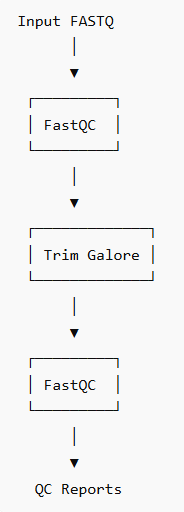
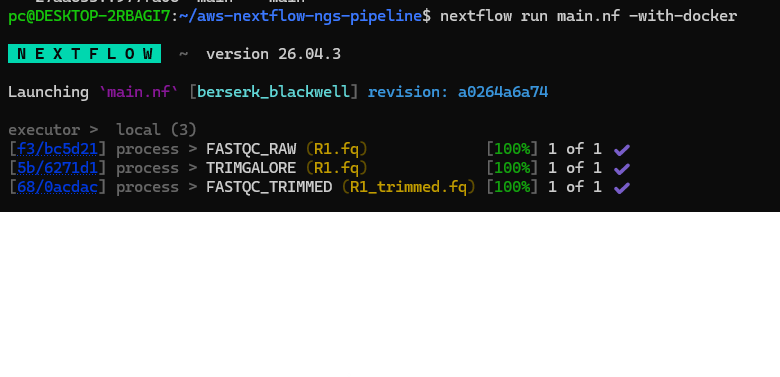
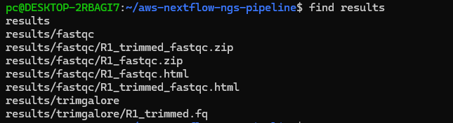

# aws-nextflow-ngs-pipeline

A cloud-ready bioinformatics pipeline for next-generation sequencing (NGS) data processing built with Nextflow, Docker and Infrastructure as Code principles.

## Overview

This project demonstrates the development of a reproducible and containerized bioinformatics workflow for processing sequencing data.

The pipeline follows modern Bioinformatics and DevOps best practices:

* workflow automation with Nextflow
* containerized execution with Docker
* reproducible analyses
* modular pipeline architecture
* cloud-ready deployment design
* version-controlled infrastructure

The long-term goal is to extend the workflow for scalable execution on AWS Batch using Terraform-managed infrastructure.

---
## Scientific Motivation

Modern genomics projects routinely generate terabytes of sequencing data that require scalable, reproducible, and automated processing.

Workflow management systems such as Nextflow, combined with containerization and cloud infrastructure, have become standard solutions for large-scale bioinformatics pipelines.

This project explores how reproducible NGS workflows can be designed using modern software engineering and infrastructure practices.

---

## Workflow

### Current Implementation

```text
FASTQ
  ↓
FastQC
  ↓
Trim Galore
  ↓
FastQC (trimmed reads)
```

### Planned Production Workflow

```text
FASTQ
  ↓
FastQC
  ↓
Trim Galore
  ↓
FastQC
  ↓
BWA Alignment
  ↓
SAMtools
  ↓
BCFtools Variant Calling
  ↓
MultiQC Report
```

---

## Workflow Diagram



## Example Pipeline Execution



## Example Results



---

## Technologies

### Workflow & DevOps

* Nextflow
* Docker
* Git
* GitHub
* Linux (Ubuntu / WSL2)

### Bioinformatics Tools

* FastQC
* Trim Galore

### Cloud & Infrastructure

* AWS Batch (planned)
* AWS S3 (planned)
* AWS ECR (planned)
* Terraform (planned)

---

## Repository Structure

```text
.
├── main.nf
├── nextflow.config
├── modules/
│   ├── fastqc.nf
│   └── trimgalore.nf
├── docker/
│   ├── fastqc/
│   └── trimgalore/
├── data/
├── docs/
├── terraform/
└── README.md
```

---

## Running the Pipeline

### Requirements

* Docker
* Nextflow
* Linux / WSL2

### Execute

```bash
nextflow run main.nf -with-docker
```

---

## Example Output

```text
results/
├── fastqc/
│   ├── R1_fastqc.html
│   ├── R1_fastqc.zip
│   ├── R1_trimmed_fastqc.html
│   └── R1_trimmed_fastqc.zip
└── trimgalore/
    └── R1_trimmed.fq
```

---

## Skills Demonstrated

### Bioinformatics

- NGS quality control
- FASTQ processing
- Workflow automation
- Reproducible genomics pipelines

### Workflow Engineering

- Nextflow DSL2
- Modular pipeline architecture
- Containerized execution
- Pipeline orchestration

### Cloud & DevOps

- Docker
- Infrastructure as Code
- Terraform
- AWS Batch architecture
- Git-based development

### Research Computing

- Linux
- Bash
- High-throughput computing
- Scalable data processing

---
## Key Takeaway

This project demonstrates how modern bioinformatics workflows can be designed using workflow orchestration, containerization, and infrastructure automation principles.

The resulting architecture supports reproducibility, scalability, and future deployment in cloud-based genomics environments.

---

## Future Development

Planned enhancements:

* MultiQC integration
* BWA alignment module
* SAMtools processing
* BCFtools variant calling
* AWS Batch execution
* Amazon S3 integration
* Terraform deployment automation
* CI/CD with GitHub Actions

---

## Author
Incoming MSc Bioinformatics Student

Research Interests:

- Bioinformatics Infrastructure
- Computational Biology
- Cloud Computing for Genomics
- Reproducible Research
- Cancer Genomics

---

## Project Status

🚧 Active development

Current version includes FastQC and Trim Galore modules running successfully in Docker containers through Nextflow. AWS integration and downstream NGS analysis modules are currently under development.
